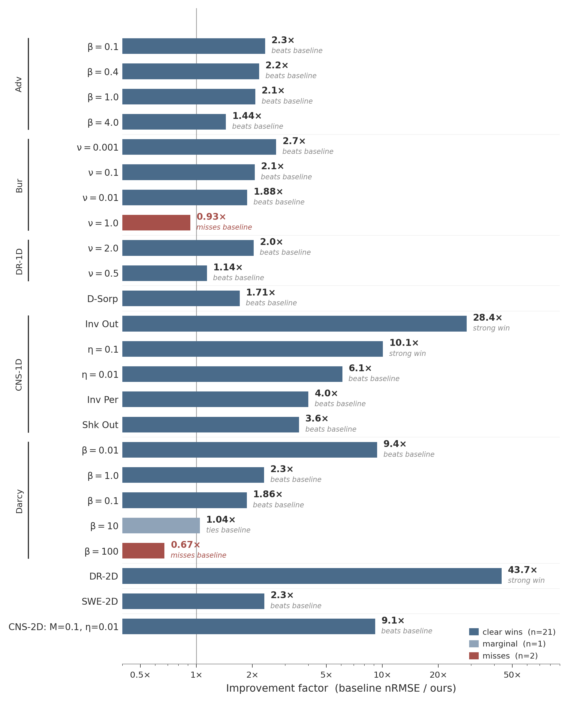

# The Unrealized Potential of Fourier Neural Operators

**A Systematic Re-evaluation of PDEBench Baselines**

NeurIPS 2026 Evaluations & Datasets Track Submission



*Per-timestep nRMSE ratio of PDEBench FNO (arXiv:2210.07182v7) to ours, log scale. Higher is better. Green: clear win (n=21); amber: marginal (n=1); red: miss (n=2). See `standalone/evaluate_predictions.py --json-only` to reproduce these numbers from the saved `results.json` files.*

## Overview

Published PDEBench FNO baselines dramatically underestimate the Fourier Neural Operator. Through principled training methodology, we obtain **21 clear wins, one marginal point-estimate win, and two misses** across 24 selected PDEBench configurations, with improvement factors ranging from 1.04x to 43.7x.

All comparisons use baselines from **arXiv:2210.07182v7** (26 Aug 2024) uniformly.

### Headline Results

| PDE | Improvement | Our nRMSE | Baseline (v7) |
|-----|-------------|-----------|---------------|
| 2D Diffusion-Reaction | **43.7x** | 2.74e-3 | 0.12 |
| 2D Compressible CFD | **9.1x** | 1.86e-2 | 0.17 |
| 1D Inviscid Comp. Flow (outgoing) | **28.4x** | 0.236 | 6.7 |
| 1D Comp. NS (η=0.1) | **10.1x** | 6.76e-3 | 0.068 |

---

## Reviewer Verification

The main claims can be verified **without downloading PDEBench or training any model**.

### Tier A: Table verification (no download, <1 min, CPU only, numpy only)

Regenerates all tables from saved JSON logs. **Only depends on `numpy`** — no
HuggingFace library, no HuggingFace account, no internet access required.

```bash
pip install numpy   # only dependency for Tier A

# Verify 21 clear wins + 1 marginal + 2 misses from saved results
python standalone/evaluate_predictions.py --json-only

# Same, with 95% bootstrap confidence intervals over test samples
python standalone/evaluate_predictions.py --json-only --ci

# Show arXiv v7 vs NeurIPS supplement discrepancies
python standalone/evaluate_predictions.py --json-only --verify-baselines

# Browse the 24 test configurations
python standalone/evaluate_predictions.py --catalog
```

The `--ci` flag prints precomputed 95% percentile bootstrap CIs (10,000
resamples, seed 42) over test samples for each row. The CIs are stored in
each `results/test_*/results.json` under `bootstrap_ci_pertimestep` and
`bootstrap_ci_frobenius`. To recompute them from raw prediction tensors,
run `python standalone/compute_bootstrap_cis.py` (requires the cached
`.npz` files from `--all` first).

### Tier B: Metric recomputation from predictions (~16 GB, CPU only)

Downloads prediction tensors from HuggingFace (containing both model outputs
and ground truth) and **independently recomputes nRMSE** from raw arrays.

```bash
pip install -r requirements-min.txt   # numpy + huggingface_hub

# Recompute the 24 headline tests (paper Table 1: 21 wins, 1 marginal, 2 misses)
python standalone/evaluate_predictions.py --all

# Recompute every catalog entry: 24 headline + Test 28 (exploratory) + 3 supplementary CFD configs
python standalone/evaluate_predictions.py --all-entries

# Recompute specific tests (mix numeric and compound IDs)
python standalone/evaluate_predictions.py --test 13 26 29
python standalone/evaluate_predictions.py --test 29_M01_Eta01

# Recompute one test to spot-check (~42 MB)
python standalone/evaluate_predictions.py --test 13
```

The HuggingFace dataset is **public, no account or login required**. Anonymous
downloads work; the `huggingface_hub` library will print a one-line warning
about rate limits which can be ignored. If `huggingface_hub` is not installed
or the network is unavailable, the script automatically falls back to reading
nRMSE values from the local JSON files (Tier A behavior, same final numbers).

Each test shows: recomputed nRMSE, integrity checks (no NaN, IC preserved,
non-trivial predictions, no near-perfect samples), and comparison against baseline.

### Tier C: Checkpoint evaluation (needs GPU + PDEBench data)

Loads saved model weights and runs full inference on the PDEBench test set.
This is the strictest verification path: no shortcut through saved tensors,
the model itself is loaded and evaluated from scratch. Requires PyTorch,
a CUDA GPU, and the relevant PDEBench HDF5 file from
[DaRUS](https://darus.uni-stuttgart.de/dataset.xhtml?persistentId=doi:10.18419/darus-2986).

```bash
pip install -r requirements.txt   # numpy + huggingface_hub + torch + h5py

# 1. Get the checkpoint from HuggingFace (e.g. Test 13)
huggingface-cli download pdebench-fno-audit/fno-weights test_13_best_model.pt \
    --local-dir ./weights

# 2. Get the matching PDEBench data file from DaRUS (filename and ID per test
#    are documented in standalone/evaluate.py and in the training scripts)
wget https://darus.uni-stuttgart.de/api/access/datafile/133185 \
    -O ReacDiff_Nu2.0_Rho1.0.hdf5

# 3. Run inference and recompute nRMSE
python standalone/evaluate.py --checkpoint weights/test_13_best_model.pt \
    --data ./ReacDiff_Nu2.0_Rho1.0.hdf5 \
    --pde 1d --modes 32 --width 96 --init_step 10 --nc 1
```

The exact `--modes`, `--width`, `--init_step`, `--nc`, and `--arch` arguments
for each test are recorded in the `architecture` block of the corresponding
`results/test_<id>/results.json` file.

### Tier D: Full retraining (optional, ≥200 GPU-hours)

Training scripts under `training/` use [Modal](https://modal.com) serverless
GPU compute. They are deployed and spawned remotely; **none of them run on
a local machine without Modal credentials**. They are provided for
completeness and full transparency, not for review-time verification.

```bash
pip install modal
modal token new                      # one-time Modal account setup
modal deploy training/2d_diffusion_reaction/fno2d_timedep_batch.py
modal run training/2d_diffusion_reaction/fno2d_timedep_batch.py
```

The main claims of the paper can be verified without retraining via Tiers A,
B, or C above.

---

## All scripts at a glance

| Script | Purpose | Tier | Local-runnable? | Dependencies |
|---|---|:---:|:---:|---|
| `standalone/evaluate_predictions.py --json-only` | Print the full 28-entry catalog table from local JSON, separated into 24 headline tests + supplementary | A | yes | `numpy` only |
| `standalone/evaluate_predictions.py --catalog` | List all 28 tests with PDE, parameters, baseline | A | yes | `numpy` only |
| `standalone/evaluate_predictions.py --json-only --verify-baselines` | Show arXiv-v7 vs NeurIPS-supplement discrepancies | A | yes | `numpy` only |
| `standalone/evaluate_predictions.py --all` | Download the **24 headline** predictions from HF, recompute nRMSE | B | yes | `numpy`, `huggingface_hub` |
| `standalone/evaluate_predictions.py --all-entries` | Same as `--all` plus Test 28 (exploratory) + 3 supplementary 2D CFD configs | B | yes | `numpy`, `huggingface_hub` |
| `standalone/evaluate_predictions.py --test 13 26 29` | Selected tests by ID (numeric or compound: e.g. `--test 29_M01_Eta01`) | B | yes | `numpy`, `huggingface_hub` |
| `standalone/evaluate.py --checkpoint ... --data ...` | Load weights, run inference on PDEBench, compute nRMSE | C | yes (with GPU) | `requirements.txt` (full) + GPU + PDEBench HDF5 |
| `standalone/models.py` | FNO architecture definitions (library, not a script) | — | n/a (imported by evaluate.py) | `torch` |
| `analysis/*.py` (5 files) | Diagnostic and ablation scripts (boundary decomposition, pipeline audit, W2/W3 ablations) | — | **no** | Modal-deployed |
| `training/**/*.py` (16 files) | Per-test training scripts | D | **no** | Modal-deployed; require Modal account, GPU credit, and PDEBench data on a Modal volume |

If `huggingface_hub` is not installed or unavailable, the `--all` and `--test`
modes automatically fall back to reading nRMSE from local JSON (Tier A
behavior), so a reviewer with only `numpy` can still verify every reported
number, just without the independent recomputation from raw arrays.

---

## Repository Structure

```
.
├── standalone/                     # Verification scripts that run locally
│   ├── evaluate_predictions.py     # Tier A + B: nRMSE from JSON or HF predictions
│   ├── evaluate.py                 # Tier C: full checkpoint inference (needs GPU)
│   └── models.py                   # FNO architecture library (imported by evaluate.py)
├── results/                        # All reported numbers, in machine-readable form
│   ├── test_01/ ... test_29/       # Per-test results.json (one per configuration)
│   ├── test_29_M01_Eta01/ ...      # Three supplementary 2D CFD configurations
│   └── ablations/                  # A1–A4, W2, W3 component ablations
├── training/                       # Tier D: Modal-deployed training scripts (NOT
│                                   #   local-runnable; require Modal credentials)
├── analysis/                       # Modal-deployed diagnostic/ablation scripts
│                                   #   (NOT local-runnable; require Modal credentials)
├── assets/                         # README figure(s)
├── LICENSE                         # MIT
├── requirements-min.txt            # Tier A + B (numpy + huggingface_hub)
└── requirements.txt                # Tier C + D (full: torch + h5py + modal)
```

## Artifacts on HuggingFace

| Artifact | Repo | Size |
|----------|------|------|
| Prediction tensors (24 tests) | [`pdebench-fno-audit/fno-predictions`](https://huggingface.co/datasets/pdebench-fno-audit/fno-predictions) | ~4.8 GB |
| Model weights (24 checkpoints) | [`pdebench-fno-audit/fno-weights`](https://huggingface.co/pdebench-fno-audit/fno-weights) | ~196 MB |

Each `.npz` prediction file contains `preds` (model output) and `targets`
(ground truth), so reviewers can recompute nRMSE without any other download.

## Key Components

1. **Normalized MSE Loss** — Aligns training with nRMSE evaluation (2.05x degradation when removed)
2. **Cosine Annealing** — Extended training with modern LR scheduling
3. **Log-Space Prediction** — Domain-specific output for compressible flows
4. **Gated Local-Global Blocks** — Balanced spectral-spatial processing for shock capture

These are family-agnostic components applied across the selected configurations.
Section 6 of the paper provides targeted ablations; these support localized
conclusions but do not establish a universal cross-family ranking.

## License

This project is released under the MIT License.
